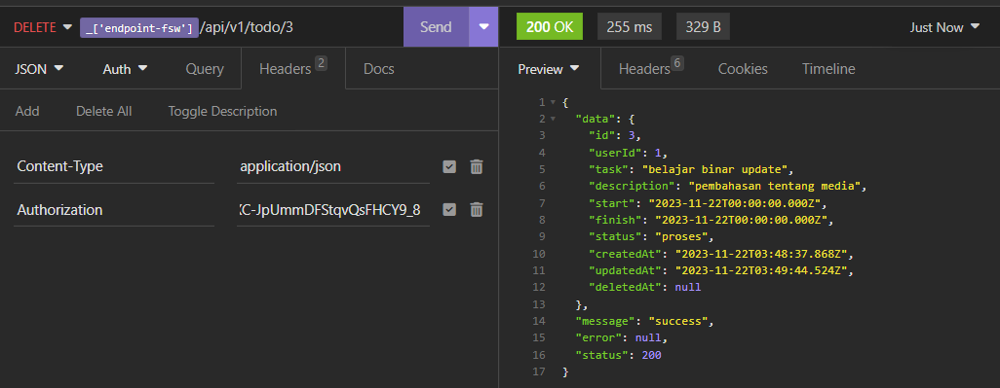

# BINAR ALGORITHM BACKEND MOCK TEST

## Algorithm Test 
Algorithm Mock tes on Folde `algorithm-test`

## Project Todolist API

This is my project Backend API Todolist with tech stack `nodeJs, ExpressJs, Postgres`

The module nodejs used are in `package.json` file.

`index.js` used to run the service

## Install module nodejs

    npm install

## Migrate Database with prisma

    npx prisma migrate dev

## Run the app

    npm run dev

# REST API

The REST API to the todolist app is described below.

## Auth - Registration

### Request

``` 
POST /api/v1/auth/register HTTP/1.1
Content-Type: application/json
Host: binar-algorithm-fsw-mock-test-production.up.railway.app
Content-Length: 69

{
	"name": "user",
	"email": "user@mail.com",
	"password": "123123"
}
```


## Auth - Login

### Request

``` 
POST /api/v1/auth/login HTTP/1.1
Content-Type: application/json
Host: binar-algorithm-fsw-mock-test-production.up.railway.app
Content-Length: 52

{
	"email": "user@mail.com",
	"password": "123123"
}
```

You will get a token that will be used to get authorization to perform CRUD todolist


## Auth - Whoami

### Request

``` 
GET /api/v1/auth/whoami HTTP/1.1
Authorization: yourAuthorization (token from jwt)
Host: binar-algorithm-fsw-mock-test-production.up.railway.app
```


## Todolist - Get

### Request

``` 
GET /api/v1/todo HTTP/1.1
Content-Type: application/json
Authorization: yourAuthorization (token from jwt)
Host: binar-algorithm-fsw-mock-test-production.up.railway.app
```


## Todolist - Insert

### Request

``` 
POST /api/v1/todo HTTP/1.1
Content-Type: application/json
Authorization: yourAuthorization (token from jwt)
Host: binar-algorithm-fsw-mock-test-production.up.railway.app
Content-Length: 176

{
	"task": "binar user",
	"description": "pembahasan tentang media handling",
	"start": "2023-11-22T08:09:59.908Z",
	"finish": "2023-11-22T08:09:59.908Z",
	"status": "proses"
}
```


## Todolist - Update

### Request

``` 
PUT /api/v1/todo/3 HTTP/1.1
Content-Type: application/json
Authorization: yourAuthorization (token from jwt)
Host: binar-algorithm-fsw-mock-test-production.up.railway.app
Content-Length: 177

{
	"task": "belajar binar update",
	"description": "pembahasan tentang media",
	"start": "2023-11-22T08:10:48.451Z",
	"finish": "2023-11-22T08:10:48.452Z",
	"status": "proses"
}
```


## Todolist - Delete

### Request

``` 
DELETE /api/v1/todo/3 HTTP/1.1
Content-Type: application/json
Authorization: yourAuthorization (token from jwt)
Host: binar-algorithm-fsw-mock-test-production.up.railway.app
```



## Todolist - Get (another user)

### Request

``` 
GET /api/v1/todo HTTP/1.1
Content-Type: application/json
Authorization: yourAuthorization (token from jwt when login)
Host: binar-algorithm-fsw-mock-test-production.up.railway.app
```


## Todolist - Delete (todolist on another user)


## Todolist - Update (todolist on another user)


